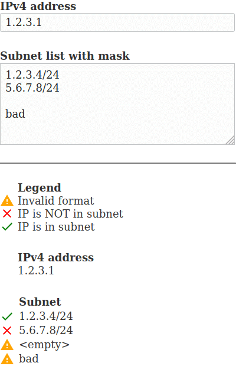

# IP in subnet list checker

This proyect contains the code to check which subnet in a list includes the specified IP v4 address.

# How to use it

Open the [index.html](index.html) file in your browser.
Enter the IP address and a list of subnets.
As soon as one of the inputs is modified, it will be evaluated.

